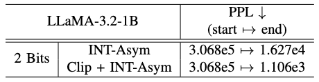
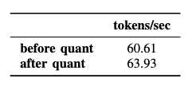

# [ACL 2024] BitDistiller: Unleashing the Potential of Sub-4-Bit LLMs via Self-Distillation [[paper]](http://arxiv.org/abs/2402.10631)

**Implementing efficient sub-4-bit weight quantization (3 / 2 bits) in LLMs through advanced QAT-based Self-Distillation techniques.**

## Contents
1. [Setup](#1-setup)
2. [Running](#2-running)
3. [Evaluation](#3-evaluation)
4. [Inferencce](#4-inference)

## 1. Setup
Make sure you have:
* python >=3.9, pytorch >= 1.13
  
and run the following command:
```bash
pip install -r requirements.txt 
```
>Note: You may need to change the version of transformers according to the model config.

When I reproduced this project, I utilized llama-3.2-1B, you may download the model from [here](https://huggingface.co/NousResearch/Llama-3.2-1B/tree/main) or [here](https://huggingface.co/meta-llama/Llama-3.2-1B/tree/main).

Put the model (the whole HF directory containing files like config.json and model.safetensors) at the same directory of this readme.md, rename it to `llama`. 

I used the *pile* dataset for calibration during asymmetric clipping.

>Note: If the program constantly fails to fetch the dataset from HuggingFace, you may need to use a mirror source of HuggingFace, e.g., https://hf-mirror.com

>Note: It is not advisable to use old GPUs like TITAN X, because there can be compatibility problems. I used one A800 80G GPU for the most part of this project. It is absolutely advisable to use more GPUs to run this project (80GB of VRAM is barely enough), even though it is just a 1B model. 

It is highly recommended to create a conda virtual environment and then install the `vllm` module inside it for future use.

## 2. Running

The whole process is done in three steps.

### 2.1. Asymmetric Quantization

Run `run_autoclip_wrapper.py`.

You will be prompted to input necessary arguments to run the clipping. If you would like to reproduce this project, simply press enter to use the defaults.

You will have a file named `clipped_results.pt` upon completion.

### 2.2. Generate Teacher Data

Go to the virtual environment that I recommended you to create.

Run `run_data_gen_with_vllm.py`.

You will be prompted to input necessary arguments to run the teacher data generation process. You will need two rounds of execution, in the first round, simply use all the defaults; in the second run, choose *alpaca* as the dataset name and set maximum number of samples to *5000*.

After that, run:

```bash
cd data/generation

python mix_data.py
```

### 2.3. KD-base QAT

To run QAT, you can execute:

```bash
cd train
    
bash train.sh ../data/generation/datasets/hf-llama-1B/mix_wiki_alpaca_8000.json ./ckpts/hf-llama-1B/int2-g128/ ./logs/hf-llama-1B/int2-g128/ 4
```

## 3. Evaluation
This project evaluates two metrics: PPL and the token generation speed in tokens/sec.

* To evaluate PPL, you can run:
```bash
python get_PPL.py
```
You may need to change the model path inside the script.

* To evaluate tokens/sec, you can run

```bash
python token_speed_test.py  # For the full-precision model
python token_speed_test_for_quant.py # For quantizing and testing the model
```

The results are based on the 12th checkpoint during QAT. Because one A800 is not really capable of reproducing the original project.


